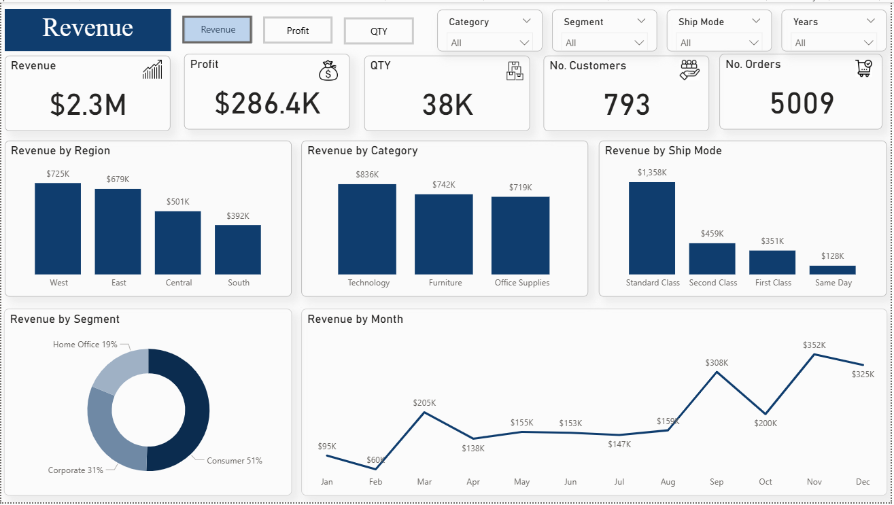
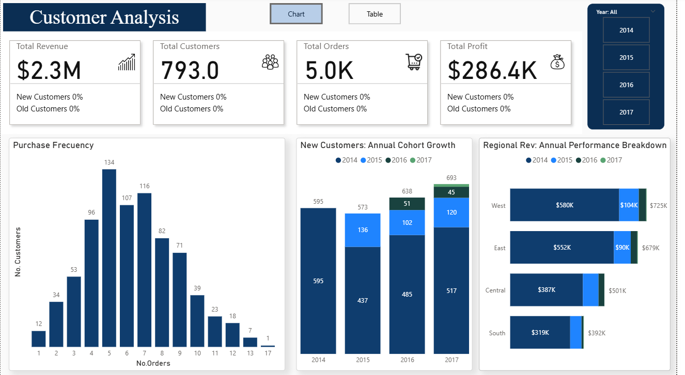
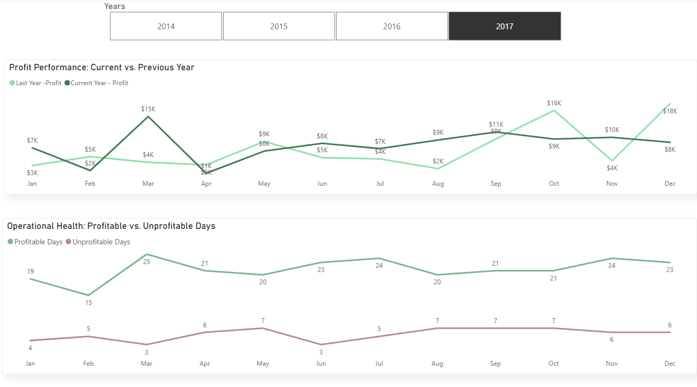

# Sales Performance & Customer Insights Dashboard

I built this dashboard to analyze retail business performance across sales, profitability, customer behavior, and operational trends using the Superstore dataset. The project focuses on uncovering the factors driving revenue growth, customer acquisition, and profit fluctuations through interactive Power BI dashboards and KPI analysis.

---

# Project Goal

The objective of this project was to move beyond simple KPI reporting and develop a more comprehensive understanding of business performance across multiple operational dimensions.

Key business questions included:

* Which regions and product categories generate the highest revenue?
* How does profitability fluctuate over time?
* Are customer acquisition trends improving year over year?
* Which operational areas contribute to profit loss?
* How do customer segments and shipping modes impact business performance?

The dashboard was designed to help stakeholders monitor sales health, identify profitability issues, and support data-driven operational decisions.

---

# What’s in the Data?

The analysis is based on the Superstore retail dataset.

### Dataset Includes:

## Sales Metrics
* Revenue
* Profit
* Orders
* Quantity Sold

## Product Information
* Product Categories
* Sub-Categories

## Customer Segments
* Consumer
* Corporate
* Home Office

## Geographic Information
* West
* East
* Central
* South regions

## Shipping Modes
* Standard Class
* Second Class
* First Class
* Same Day

## Time-Based Data
* Monthly trends
* Yearly trends
* Order dates

---

# Dashboard Walkthrough

## 1. Executive Overview

This page provides a high-level overview of overall business performance.

### Key Metrics:
* Total Sales
* Total Profit
* Order Volume
* Quantity Sold
* Year-over-Year Sales Trends

### Key Findings:
* Revenue growth trends fluctuate seasonally across months
* Certain product categories consistently outperform others
* Sales performance is concentrated within specific regions

### Business Impact
* Helps stakeholders monitor overall business health
* Supports strategic sales and operational planning
* Improves visibility into long-term revenue and profit trends

---

## 2. Customer Analysis

This section focuses on customer purchasing behavior and acquisition trends.

### Analysis Included:
* Customer growth tracking
* Purchase frequency analysis
* Regional customer distribution
* Segment-based purchasing behavior

### Key Findings:
* Most customers place between 4–7 orders, indicating stable engagement behavior
* Customer acquisition increases steadily over time
* Revenue concentration is strongest in the West and East regions

### Business Impact
* Supports customer retention and acquisition strategies
* Helps identify high-performing customer segments
* Improves understanding of regional sales behavior

---

## 3. Profitability & Operational Insights

This page analyzes operational performance and profit stability over time.

### Analysis Included:
* Profitability tracking
* Monthly profit fluctuations
* Profitable vs. unprofitable periods
* Operational performance monitoring

### Key Findings:
* Profit margins fluctuate significantly across different periods
* Some months show weaker operational performance compared to previous years
* Profitability inconsistencies may indicate pricing or discounting inefficiencies

### Business Impact
* Helps identify periods of operational underperformance
* Supports margin optimization and pricing decisions
* Assists in improving long-term profitability stability

---

# Tech Stack

## Dashboard & BI Tools
* Power BI Desktop
* Power Query
* DAX

## Data Processing
* Data Modeling
* Relational Analysis

## Data Source
* Excel dataset (`super_store.xlsx`)

---

# KPI & DAX Measures

The project includes several advanced KPI calculations and business performance measures, including:

* Year-to-Date (YTD) Sales Tracking
* Year-over-Year (YoY) Growth Variance
* Profitability Analysis
* Customer Cohort Analysis
* New vs. Returning Customer Tracking
* Revenue Contribution Analysis

---

# Setup & Usage

1. Download the following files:
   * `superstore-sales-performance.pbix`
   * `super_store.xlsx`

2. Open the `.pbix` file using Power BI Desktop

3. If visuals do not load:
   * Go to:
     `Transform Data → Data Source Settings`
   * Update the dataset file path
   * Click Refresh

4. Use slicers and filters to explore:
   * Regions
   * Product Categories
   * Customer Segments
   * Shipping Modes
   * Time periods

---

# Future Improvements

* Add revenue and profit forecasting models
* Implement RFM customer segmentation analysis
* Build drill-through pages for deeper operational analysis
* Integrate anomaly detection for profit fluctuations
* Develop executive-level performance scorecards

---

# Key Business Insights & Recommendations

* Revenue generation is highly concentrated in the West and East regions, indicating stronger customer demand and market penetration
* Certain product categories generate high sales volume but weaker profitability, highlighting opportunities for margin optimization
* Profit volatility across months suggests operational inefficiencies or inconsistent discounting strategies
* Customer growth trends indicate strong acquisition performance, but retention-focused analysis could further improve profitability
* Shipping modes may influence operational costs and delivery efficiency, impacting overall profit margins
* Regional and category-level analysis can support more targeted inventory and operational planning

---

# Final Note

This project demonstrates how sales, customer, and operational data can be transformed into actionable business insights using Power BI, DAX, data modeling, and performance analysis techniques.
